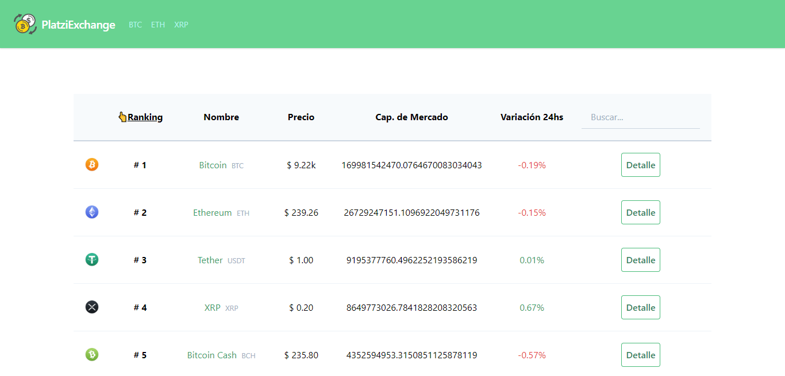

# ExchangeCripto

[Project of the basic course of Vue Js by platzi](https://platzi.com/clases/vuejs/)

Live Demo:  [ExchangeCrypto](https://exchangecrypto.netlify.com/)
  
## Project setup
```bash
npm install
```

### Compiles and hot-reloads for development
```bash
npm run serve
```

### Compiles and minifies for production
```bash
npm run build
```

### Lints and fixes files
```bash
npm run lint
```

## Views




